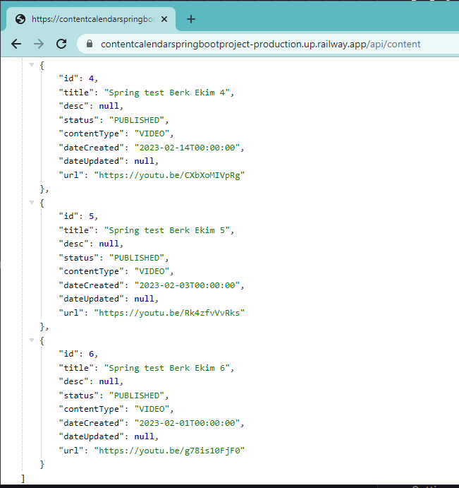

# ContentCalendarSpringBootProject  
### English description (Türkçe Anlatım Alt Tarafta)
* This project is a content calendar application developed with Spring Boot. The application allows users to plan and manage their various content (articles, blog posts, videos, etc.) on a calendar.
* Users can add different content types such as "Article", "Video" or "Event" to the calendar.
* Contents may include various fields such as title, description, status, creation date, and update date.
* Users can filter by date.
* Users can use the search box to search for content.
* Restful APIs are provided for CRUD operations (create, read, update and delete).
* The site I built with Railway can be used to test the web:  
* You can test it here  https://contentcalendarspringbootproject-production.up.railway.app/api/content 

## TECHNOLOGIES

## FEATURES
### The features in this project:

Web application served as API  
Use of PostgreSQL for database operations  
Use of H2 database for easy testability in the development phase (H2 can be added via pom.xml and tested with http://localhost:8080/h2-console)  
Portability of the application thanks to Docker  
API hosted on Railway.com for demonstration purposes  

### The project is designed as a CRUD (Create, Read, Update, Delete) system and has the following operations:

POST: Adding a new activity /api/content  
GET: Listing all activities /api/content  
GET: Listing a specific activity /api/content/{id}   
PUT: Updating a specific activity /api/content/{id}  
DELETE: Deleting a specific activity /api/content/{id}  

## INSTALLATION
### Requirements
* Docker
* Java 17

### Installation Steps
* Download the project from the GitHub page:
"git clone https://github.com/sudkostik/ContentCalendarSpringBootProject.git"
* Go to the folder where the project is located in the terminal:
 "cd ContentCalendarSpringBootProject"
* Build Docker image:
docker build -t content-calendar .
* Start Docker container:
"docker run -p 8081:8080 content-calendar"
* The application can be accessed at http://localhost:8080. 

## Pictures

### **Use of PostgreSQL and website connection**

### **Use of H2 Database**

### **Use of Docker**

### **Use of GET request**

### **Filtering**

### **Homepage at localhost:8080**

## CONTACT
* berkekimdev@gmail.com

# ContentCalendarSpringBootProject
* Bu proje, Spring Boot ile geliştirilmiş bir içerik takvim uygulamasıdır. Uygulama, kullanıcıların çeşitli içeriklerini (makaleler, blog yazıları, videolar vb.) takvim üzerinde planlamalarına ve yönetmelerine olanak sağlar.  
* Kullanıcılar, takvime "Makale", "Video" veya "Etkinlik" gibi farklı içerik türlerini ekleyebilirler.  
* İçerikler, başlık, açıklama, durum, oluşturma tarihi ve güncelleme tarihi gibi çeşitli alanları içerebilir.  
* Kullanıcılar, tarihe göre filtreleme yapabilirler.  
* Kullanıcılar, içerikleri aramak için arama kutusunu kullanabilirler.  
* CRUD işlemleri (oluşturma, okuma, güncelleme ve silme) için Restful API'ler sağlanmaktadır.  
* Railway ile birlikte oluşturduğum siteyle web üzerinden testler yapılabilir :  
* Burdan test yapabilirsiniz https://contentcalendarspringbootproject-production.up.railway.app/api/content 

## TEKNOLOJİLER

## Özellikler
### Bu projede bulunan özellikler:

API olarak sunulan web uygulaması  
Veritabanı işlemleri için PostgreSQL kullanımı  
Geliştirme aşamasında kolay test edilebilirlik için H2 veritabanı kullanımı(pom.xml üzerinden H2 eklenip http://localhost:8080/h2-console ile test edilebilir)
Docker kullanımı sayesinde uygulamanın taşınabilirliği  
Railway.com'da canlandırılarak sunulan API  

### Proje, bir CRUD (Create, Read, Update, Delete) sistemi olarak tasarlanmıştır ve aşağıdaki operasyonlar mevcuttur:

POST: Yeni bir aktivite ekleme /api/content  
GET: Tüm aktiviteleri listeleme /api/content  
GET: Belirli bir aktiviteyi listeleme /api/content/{id}   
PUT: Belirli bir aktiviteyi güncelleme /api/content/{id}  
DELETE: Belirli bir aktiviteyi silme /api/content/{id}  

## Kurulum
### Gereksinimler
* Docker
* Java 17

### Kurulum Adımları
* GitHub sayfasından projeyi indirin:
"git clone https://github.com/sudkostik/ContentCalendarSpringBootProject.git"
* Terminalde projenin bulunduğu klasöre gidin:
 "cd ContentCalendarSpringBootProject"
* Docker İmajını Oluşturun:
docker build -t content-calendar .
* Docker container'ı başlatın:
"docker run -p 8081:8080 content-calendar"
* Uygulama, http://localhost:8080 adresinden erişilebilir. 

## Pictures

### **PostgreSQL kullanımı ve web sitesi bağlantısı**

### **H2 Database Kullanımı**

### **Docker Kullanımı**

### **GET isteği kullanımı**

### **Filtreleme**

### **localhost:8080 anasayfa görüntüsü**

## İletişim
* berkekimdev@gmail.com

